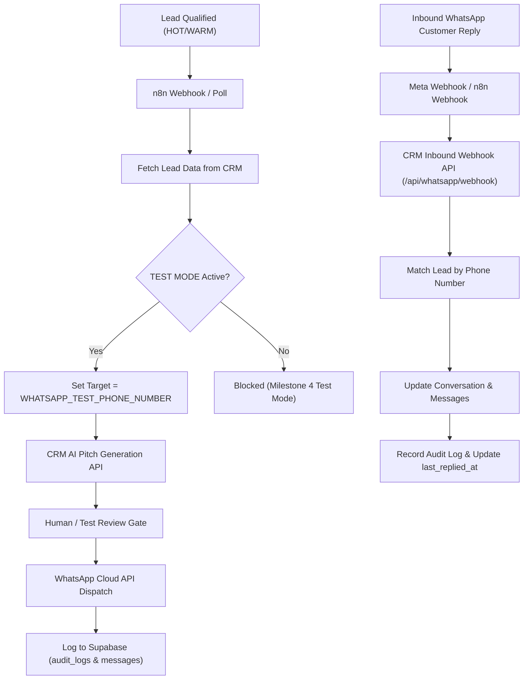

# Reliable Vision — n8n Automation Architecture

This directory contains the automation workflow blueprints for connecting **Reliable Vision CRM** with **n8n** and **WhatsApp Cloud API** in **TEST MODE**.

---

## 1. Safety & TEST MODE Rules

> [!IMPORTANT]
> **Safety Guard**: The automation pipeline operates strictly in **TEST MODE**.
> - Real leads in the CRM (all 668 imported leads) are protected and will never receive live messages.
> - All outbound dispatch calls are locked to the configured `WHATSAPP_TEST_PHONE_NUMBER`.
> - If an outbound message targets any phone number other than the test number, the server API rejects it with HTTP 403.

---

## 2. Architecture Diagram

---

## 3. Workflow Import Steps

1. In your n8n dashboard, click **Add Workflow** ➔ **Import from File...**
2. Select [`reliable_vision_whatsapp_workflow.json`](./reliable_vision_whatsapp_workflow.json).
3. Set your environment variables in n8n or `.env`:
   - `CRM_BASE_URL`: `http://localhost:3000` (or production URL)
   - `TEST_MODE`: `true`
   - `WHATSAPP_TEST_PHONE_NUMBER`: `+919876543210` (your test mobile number)
4. Activate the workflow for testing.

---

## 4. Webhook URLs in Reliable Vision CRM

- **Outbound Test Trigger:** `POST /api/automation/send`
- **AI Pitch Generator:** `POST /api/automation/test-message`
- **Inbound WhatsApp Webhook:** `POST /api/whatsapp/webhook`
- **Meta Verification Handshake:** `GET /api/whatsapp/webhook`
